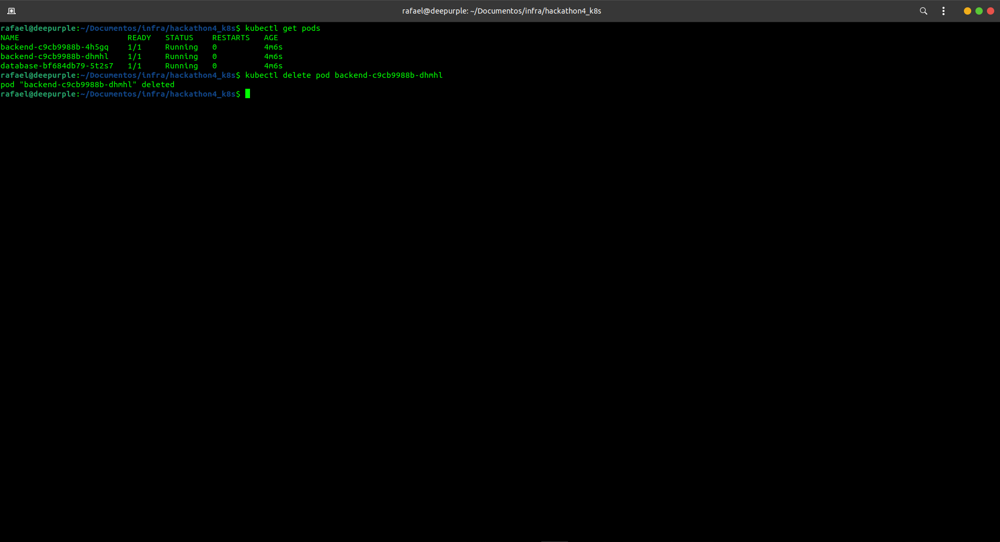

# hackathon4_k8s

Atividade do Hackathon 4 do curso IT Talent DevOps 2024

## Prints da atividade

### Criação do Deployment

### Lista os deployments do database e backand

### Lista os replicasets

### Lista os pods após alguns minutos de execução

### Deleta um dos pods

### Exibe a recriação automática do pod
